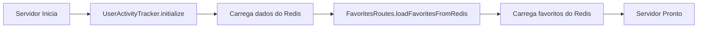
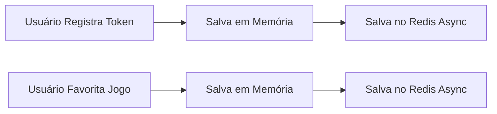

# 🔄 Sistema de Persistência com Redis

## 📋 Visão Geral

Sistema de persistência implementado para resolver o problema de **dados voláteis em memória**. Agora todos os dados críticos são salvos no **Redis** e recuperados automaticamente ao reiniciar o servidor.

---

## 🎯 Problemas Resolvidos

### ❌ **Antes** (Dados em Memória Volátil)
- ✗ Reiniciar servidor → Perdia todos os usuários registrados
- ✗ Reiniciar servidor → Perdia todos os favoritos
- ✗ Reiniciar servidor → Perdia cache de preços (watched games)
- ✗ Notificações paravam de funcionar após restart
- ✗ Sistema quebrava completamente a cada deploy

### ✅ **Depois** (Persistência com Redis)
- ✓ Reiniciar servidor → Dados permanecem intactos
- ✓ Deploy em produção → Zero downtime de dados
- ✓ Notificações continuam funcionando normalmente
- ✓ Escalabilidade: Múltiplas instâncias podem compartilhar dados
- ✓ Backup automático via Redis persistence (RDB/AOF)

---

## 📦 Serviços de Persistência Criados

### 1. **UserActivityPersistence** 
📁 `src/services/persistence/user-activity-persistence.service.ts`

**Responsabilidade**: Persistir atividades de usuários e push tokens

**Dados Salvos**:
- `userId` - ID único do usuário
- `pushToken` - Token para notificações push
- `lastActiveAt` - Última vez que usou o app
- `notificationsSent` - Contador de notificações enviadas
- `lastNotificationAt` - Data da última notificação

**TTL**: 90 dias (usuários inativos são removidos automaticamente)

**Prefixo Redis**: `user_activity:{userId}`

**Métodos**:
```typescript
- save(activity: UserActivity): Promise<void>
- load(userId: string): Promise<UserActivity | null>
- loadAll(): Promise<UserActivity[]>
- delete(userId: string): Promise<void>
- clear(): Promise<void>
```

---

### 2. **FavoritesPersistence**
📁 `src/services/persistence/favorites-persistence.service.ts`

**Responsabilidade**: Persistir jogos favoritos dos usuários

**Dados Salvos**:
- Lista completa de favoritos por usuário
- `gameId`, `title`, `stores`, `desiredPrice`, etc.

**TTL**: 180 dias

**Prefixo Redis**: `favorites:{userId}`

**Métodos**:
```typescript
- save(userId: string, favorites: Favorite[]): Promise<void>
- load(userId: string): Promise<Favorite[]>
- loadAll(): Promise<Map<string, Favorite[]>>
- addFavorite(userId: string, favorite: Favorite): Promise<void>
- removeFavorite(userId: string, favoriteId: string): Promise<boolean>
- updateFavorite(userId: string, favoriteId: string, updates: Partial<Favorite>): Promise<boolean>
```

---

### 3. **PriceCachePersistence**
📁 `src/services/persistence/price-cache-persistence.service.ts`

**Responsabilidade**: Persistir cache de preços para detectar mudanças (Watched Games)

**Dados Salvos**:
- `price` - Preço atual do jogo
- `discount` - Desconto atual
- `lastUpdated` - Data da última atualização

**TTL**: 30 dias

**Prefixo Redis**: `price_cache:{userId}:{gameId}`

**Métodos**:
```typescript
- save(userId: string, gameId: string, cache: PriceCache): Promise<void>
- load(userId: string, gameId: string): Promise<PriceCache | null>
- loadUserPrices(userId: string): Promise<Map<string, PriceCache>>
- loadAll(): Promise<Map<string, Map<string, PriceCache>>>
- delete(userId: string, gameId: string): Promise<void>
- deleteUser(userId: string): Promise<void>
```

---

## 🔧 Configuração

### **1. Habilitar Redis** (.env)
```bash
USE_REDIS=true
REDIS_URL=redis://localhost:6379
```

### **2. Iniciar Redis**
```bash
# Docker Compose (recomendado)
cd looton/backend
docker compose up -d

# Ou Docker direto
docker run -d --name looton-redis -p 6379:6379 redis:latest

# Ou instalar localmente
# Windows: https://redis.io/docs/getting-started/installation/install-redis-on-windows/
# Linux: sudo apt install redis-server
# Mac: brew install redis
```

### **3. Verificar Conexão**
```bash
# Testar se Redis está rodando
redis-cli ping
# Resposta esperada: PONG
```

---

## 🔄 Fluxo de Carregamento Automático

### **Inicialização do Servidor**:



### **Operações em Tempo Real**:



---

## 📊 Estrutura de Dados no Redis

### **Chaves Armazenadas**:

```
user_activity:user_abc123           # Atividade do usuário
user_activity:user_xyz789
...

favorites:user_abc123                # Favoritos do usuário
favorites:user_xyz789
...

price_cache:user_abc123:game_456    # Cache de preço
price_cache:user_abc123:game_789
price_cache:user_xyz789:game_123
...
```

### **Exemplo de Dados**:

```json
// user_activity:user_123
{
  "userId": "user_123",
  "pushToken": "ExponentPushToken[abc...]",
  "lastActiveAt": "2025-11-04T10:30:00.000Z",
  "notificationsSent": 5,
  "lastNotificationAt": "2025-11-03T12:00:00.000Z"
}

// favorites:user_123
[
  {
    "_id": "fav_123",
    "userId": "user_123",
    "gameId": "1174180",
    "title": "Red Dead Redemption 2",
    "stores": ["steam"],
    "desiredPriceCents": 8999,
    "createdAt": "2025-11-01T08:00:00.000Z"
  }
]

// price_cache:user_123:1174180
{
  "price": 119.99,
  "discount": 40,
  "lastUpdated": "2025-11-04T06:00:00.000Z"
}
```

---

## 🔌 Integração com Código Existente

### **UserActivityTracker**

```typescript
// ANTES (Memória Volátil)
recordActivity(userId: string, pushToken?: string): void {
  this.activities.set(userId, { ...data });
}

// DEPOIS (Com Persistência)
async recordActivity(userId: string, pushToken?: string): Promise<void> {
  await this.initialize(); // Carrega do Redis se necessário
  this.activities.set(userId, { ...data });
  await userActivityPersistence.save(data); // Salva no Redis
}
```

### **Favorites Routes**

```typescript
// ANTES (Memória Volátil)
app.post('/favorites', async (req, reply) => {
  userFavorites.push(newFavorite);
  favoritesCache.set(userId, userFavorites);
  return reply.send(newFavorite);
});

// DEPOIS (Com Persistência)
app.post('/favorites', async (req, reply) => {
  userFavorites.push(newFavorite);
  favoritesCache.set(userId, userFavorites);
  
  // Salvar no Redis (async, não bloqueia resposta)
  favoritesPersistence.save(userId, userFavorites).catch(err => {
    console.error('[Favorites] Erro ao salvar no Redis:', err);
  });
  
  return reply.send(newFavorite);
});
```

### **Watched Games Job**

```typescript
// ANTES (Cache em Memória)
const lastKnownPrices = new Map();
function checkForPriceChange(userId, favorite, offers) {
  const cache = lastKnownPrices.get(userId);
  // ...
}

// DEPOIS (Cache no Redis)
async function checkForPriceChange(userId, favorite, offers) {
  const lastKnown = await priceCachePersistence.load(userId, gameId);
  await priceCachePersistence.save(userId, gameId, newPrice);
  // ...
}
```

---

## 🧪 Testando a Persistência

### **1. Registrar um Usuário**:
```bash
curl -X POST http://localhost:3000/users \
  -H "Content-Type: application/json" \
  -d '{
    "userId": "test_user_123",
    "pushToken": "ExponentPushToken[abc123...]"
  }'
```

### **2. Verificar no Redis**:
```bash
redis-cli GET user_activity:test_user_123
```

### **3. Reiniciar o Servidor**:
```bash
# Parar servidor
Ctrl+C

# Iniciar novamente
npm run dev
```

### **4. Verificar Dados Foram Recuperados**:
```bash
curl http://localhost:3000/users/test_user_123
# Deve retornar os dados salvos anteriormente!
```

---

## ⚙️ Configurações Avançadas

### **Ajustar TTL (Time To Live)**:

```typescript
// user-activity-persistence.service.ts
await redis.setex(key, 90 * 24 * 60 * 60, data); // 90 dias
```

### **Backup Manual**:

```bash
# Fazer backup do Redis
redis-cli BGSAVE

# Localização do arquivo RDB
# Linux: /var/lib/redis/dump.rdb
# Docker: Volume configurado em docker-compose.yml
```

### **Monitoramento**:

```bash
# Ver todas as chaves
redis-cli KEYS "*"

# Contar chaves por padrão
redis-cli KEYS "user_activity:*" | wc -l
redis-cli KEYS "favorites:*" | wc -l
redis-cli KEYS "price_cache:*" | wc -l

# Monitorar comandos em tempo real
redis-cli MONITOR
```

---

## 🚀 Deploy em Produção

### **Opções de Redis em Produção**:

1. **Redis Cloud** (Recomendado) - https://redis.com/try-free/
   - Gratuito até 30MB
   - Backup automático
   - Alta disponibilidade

2. **AWS ElastiCache**
   - Escalável
   - Integração com AWS

3. **Redis Labs**
   - Planos gratuitos disponíveis

4. **Self-hosted**
   - Docker + Volume persistente
   - Configurar persistence (AOF + RDB)

### **Exemplo Docker Compose (Produção)**:

```yaml
version: '3.8'
services:
  redis:
    image: redis:7-alpine
    ports:
      - "6379:6379"
    volumes:
      - redis_data:/data
    command: redis-server --appendonly yes --appendfsync everysec
    restart: unless-stopped

volumes:
  redis_data:
```

---

## 📈 Benefícios da Implementação

✅ **Confiabilidade**: Dados não se perdem ao reiniciar  
✅ **Escalabilidade**: Múltiplas instâncias compartilham dados  
✅ **Performance**: Redis é extremamente rápido (in-memory)  
✅ **Simplicidade**: API clara e fácil de usar  
✅ **Manutenção**: TTL automático limpa dados antigos  
✅ **Monitoramento**: Fácil inspecionar dados via redis-cli  

---

## 🔍 Debugging

### **Ver Dados de um Usuário**:
```bash
# Ver atividade
redis-cli GET "user_activity:user_123"

# Ver favoritos
redis-cli GET "favorites:user_123"

# Ver cache de preços
redis-cli KEYS "price_cache:user_123:*"
```

### **Limpar Cache (Desenvolvimento)**:
```bash
# Limpar tudo
redis-cli FLUSHALL

# Limpar apenas user activity
redis-cli KEYS "user_activity:*" | xargs redis-cli DEL

# Limpar apenas favoritos
redis-cli KEYS "favorites:*" | xargs redis-cli DEL
```

---

## 📚 Documentação Adicional

- [Redis Documentation](https://redis.io/docs/)
- [ioredis (Node.js Client)](https://github.com/redis/ioredis)
- [Redis Best Practices](https://redis.io/docs/manual/patterns/)

---

**🎉 Pronto! Agora o sistema de notificações é 100% confiável e persistente!**
